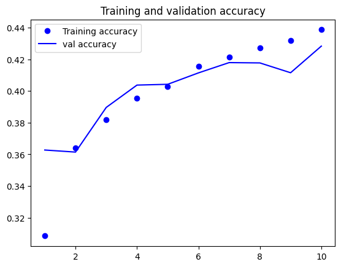
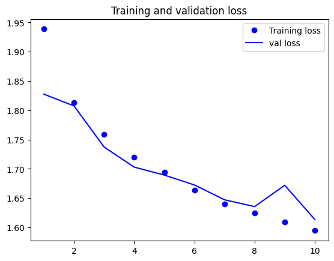

# Introduction to TensorFlow and Keras

This repository serves as a practical introduction to **TensorFlow** and **Keras**, covering everything from low-level tensor operations to high-level deep learning concepts.

## 📘 Project Overview

This document is designed to guide you through the fundamental ecosystem of modern Machine Learning. It explains how data is handled at a hardware level and how we can use high-level abstractions to build neural networks.

### 1. TensorFlow: The Engine
**TensorFlow** is the backbone of the project. It is an open-source platform that allows for:
* **Mathematical Operations:** Handling complex multi-dimensional arrays (Tensors).
* **Hardware Acceleration:** Running computations seamlessly on CPUs, GPUs, or TPUs.
* **Automatic Differentiation:** Using `GradientTape` to calculate gradients, which is the core of how AI models "learn".

### 2. Keras: The Interface
**Keras** is the high-level API built on top of TensorFlow. While TensorFlow handles the "heavy lifting," Keras provides:
* **Simplicity:** A user-friendly way to define layers, models, and optimizers.
* **Modularity:** Easily stack layers like `Dense` or `Dropout` to create complex architectures.
* **Efficiency:** It bridges the gap between complex mathematical theory and rapid prototyping.

---

## 🚀 Key Topics Covered

* **Tensors & Variables:** The difference between constant data and trainable parameters (`tf.Variable`).
* **Tensor Operations:** How to create, reshape, and manipulate data structures.
* **Gradient Computation:** Using `tf.GradientTape` to track operations and compute derivatives automatically.
* **GPU Integration:** Verifying and utilizing NVIDIA hardware for faster processing.


## 🛠️ Setup and Installation

To run the code in this repository, you need Python and the TensorFlow library installed:

```bash
# Install the environment
pip install tensorflow jupyter

# Check if GPU is recognized (optional)
nvidia-smi
```
## 🖼️ Case Study: Training on CIFAR-10 with Keras Layers

After understanding Tensors and Gradients, we apply these concepts using **Keras Layers** to solve a real-world computer vision problem: classifying images from the **CIFAR-10** dataset (60,000 32x32 color images in 10 classes).

# 🏗️ Building the Model for CIFAR-10

In this project, we apply the foundational concepts of Tensors and Variables to build a classification model for the **CIFAR-10** dataset. Instead of complex convolutional architectures, we use a **Dense (Fully Connected) Neural Network** approach to demonstrate the direct flow of data and how weights are optimized.

### 🧠 Model Architecture

The model is built using the **Keras Sequential API** with the following structure:

1.  **Input Flattening:**
    * Since CIFAR-10 images are $32 \times 32 \times 3$ pixel matrices, we use the **`Flatten`** layer first. This converts the 2D image data into a 1D vector of 3,072 values, allowing it to be fed into the processing layers.

2.  **Fully Connected Layers (`Dense`):**
    * We use **`Dense`** layers where every neuron is connected to every neuron in the previous layer.
    * These layers use the **ReLU** activation function to learn non-linear patterns from the pixel data.
    
3.  **Output Layer:**
    * The final layer is a `Dense` layer with **10 units**, representing the 10 classes of CIFAR-10 (airplane, automobile, bird, cat, deer, dog, frog, horse, ship, truck).
    * It uses the **Softmax** activation function to output a probability distribution for each class.


### 🧪 Training Process
Using the high-level Keras API, the training workflow is simplified:
1.  **Normalization:** Scaling pixel values from [0, 255] to [0, 1].
2.  **Compilation:** Defining the `adam` optimizer and `sparse_categorical_crossentropy` loss function.
3.  **Fitting:** Training the model for several epochs.

### 📈 Results

The notebook includes visualizations showing the evolution of **loss** and **accuracy** on the training and validation sets over the epochs, demonstrating the convergence of the manually implemented algorithm.

| Accuracy | Loss |
|--------|--------|
|  |  |
